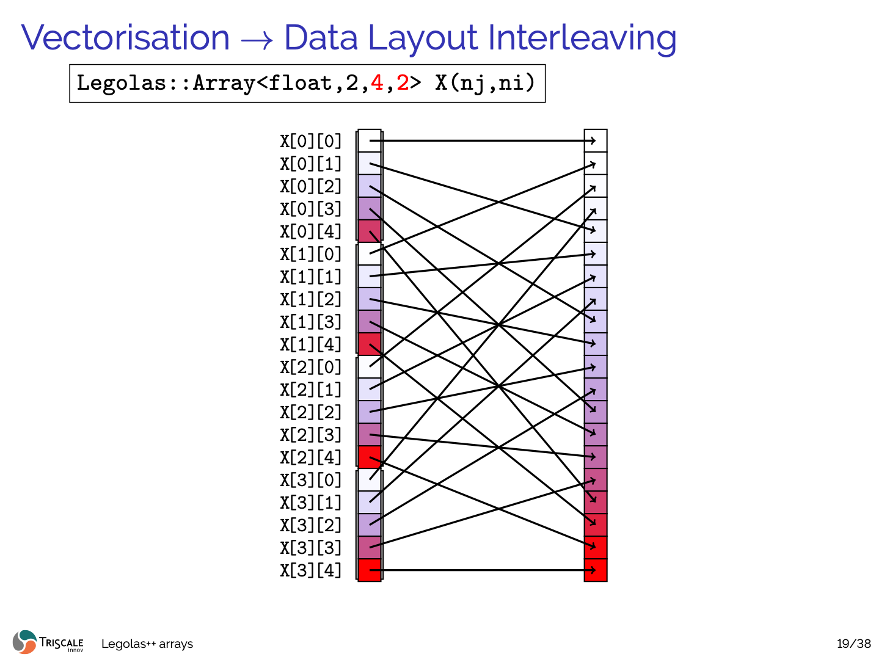

# Legolas++: Building Blocks for Linear Algebra Solvers

[]()
[-orange.svg)]()
[](https://en.wikipedia.org/wiki/C%2B%2B14)
[](https://laurentplagne.github.io/Legolas/)
[]()
[-brightgreen.svg)]()
[](License.md)

*High-Performance Modern C++ Tensor Engine for Automatic SIMD Vectorization of Recurrences via Data Layout Interleaving (DLI).*

> 💡 **Why SIMD is the Core Innovation of Legolas++**  
> While multi-threading (multi-core thread scheduling) is a widely available and commoditized feature in modern computing, **hardware SIMD vectorization across linear recurrences has historically remained an intractable barrier**.
> 
> Standard optimizing compilers (Clang, GCC, MSVC, Intel oneAPI) **systematically fail** to auto-vectorize loops with loop-carried dependencies (e.g. tridiagonal solvers, recursive IIR filters, ADI sweeps). 
> 
> **Legolas++ breaks this recurrence barrier at the CPU register level**. Using **Data Layout Interleaving (DLI)**, Legolas++ reorganizes memory across problem instances so that the exact same generic scalar loop maps directly to full-width hardware vector registers (**ARM NEON**, **x86 AVX2 / AVX-512**) without writing a single line of intrinsics or inline assembly.

> 📦 **100% Header-Only & Zero-Dependency Architecture**  
> Legolas++ is a pure C++14 template library:
> * **No compiled binary libraries**: No `.a`, `.so`, `.dylib`, or `.dll` files are built or required.
> * **Zero external dependencies**: Requires only a standard C++14 compiler and standard threads. No Eigen, no Intel TBB, no Boost.
> * **Modern CMake Integration**: Simply add `target_link_libraries(your_target Legolas)` or `#include <Legolas/Array/Array.hxx>`.

---

## 1. The Recurrence Barrier: Why Compilers Give Up

Many essential algorithms in scientific simulation, digital signal processing, quantitative finance, and deep learning feature **strict loop-carried data dependencies** where iteration $i$ requires the output of iteration $i-1$:

```cpp
// Tridiagonal elimination (Thomas forward sweep), recursive IIR filters, Gauss-Seidel:
for (int i = 1; i < N; ++i) {
    X[i] = (B[i] - L[i] * X[i-1]) * invD[i]; // Strict recurrence: RAW hazard!
}
```

Because of this sequential dependency chain:
$$X[0] \longrightarrow X[1] \longrightarrow X[2] \longrightarrow X[3] \longrightarrow \dots \longrightarrow X[N-1]$$

Every optimizing compiler falls back to **scalar execution**, leaving up to **90% of the CPU's vector compute capacity completely idle**.

---

## 2. The Breakthrough: SIMD via Data Layout Interleaving (DLI)

In real-world applications, engineers rarely solve a single isolated recurrence. Instead, they process **ensembles of independent problem instances**:
* **Scientific Computing & PDEs**: Thousands of 1D tridiagonal systems across 2D/3D ADI grids, heat diffusion, or fluid flow.
* **Real-Time Audio DSP**: Filtering 32, 64, or 128 audio channels concurrently with recursive IIR/Biquad filters.
* **Edge AI & Computer Vision**: Depthwise Separable Convolutions across channels (MobileNet, ConvNeXt).
* **Quantitative Finance**: Calibrating PDE option pricing models across thousands of strikes and maturities.

### Transposing Data at the Memory Level

Instead of struggling to vectorize sequentially along $i$, **Legolas++ interleaves $P$ independent problem instances directly in memory**:

<p align="center">
  
</p>

*Figure: Data Layout Interleaving (DLI). Elements at step $i$ across $P=4$ independent problem instances are mapped contiguously into physical memory, transforming strided access into single-instruction aligned SIMD streaming.*

### Zero-Overhead Abstraction: Write Once, Vectorize Everywhere
1. **Declare the tensor**: `Legolas::Array<T, D, P, DP>` defines a tensor of dimension `D` with packing factor `P` along dimension `DP`.
2. **Zero-cost vector view**: `.getPackedView()` exposes interleaved data directly as native SIMD vector registers (`Legolas::NativeSimd<T, P>`).
3. **Write natural scalar code**: The numerical solver is written **once** using standard scalar syntax. The same generic function compiles into hardware SIMD instructions (ARM NEON or x86 AVX2/512):

```cpp
struct ThomasSolver {
  template <class A2D>
  void operator()(int begin, int end, A2D D, A2D U, A2D L, A2D B, A2D X) const {
    using Scalar = typename A2D::RealType;
    Scalar one(1.0), s, sm1;

    for (int j = begin; j < end; ++j) {
      s = D[j][0];
      sm1 = one / s;
      X[j][0] = B[j][0] * sm1;

      // Forward sweep: executes on scalar floats OR vector NEON/AVX registers!
      for (int i = 1; i < X[j].size(); ++i) {
        s = D[j][i] - L[j][i] * (U[j][i-1] * sm1);
        X[j][i] = (B[j][i] - L[j][i] * X[j][i-1]);
        sm1 = one / s;
        X[j][i] *= sm1;
      }
      // Backward substitution...
    }
  }
};
```

---

## 3. Benchmarks on Apple Silicon (M1 Max ARM64)

The benchmark evaluates the Thomas tridiagonal algorithm across $N_y = N_x^2$ systems of size $N_x \in [8, 512]$ (up to 262,144 systems, 134M unknowns):

| Configuration | Pack Size ($P$) | Execution Mode | Peak Throughput | Speedup vs Scalar |
| :--- | :---: | :---: | :---: | :---: |
| **Scalar Baseline** | $P=1$ | Sequential (1 Core) | **2.10 GFlops** | 1.0x (Baseline) |
| **Legolas NEON SIMD** | $P=4$ | Sequential (1 Core) | **6.50 GFlops** | **3.10x** |
| **Legolas NEON Unrolled** | $P=8$ | Sequential (1 Core) | **9.97 GFlops** | **4.75x** |
| **Scalar Multi-Thread** | $P=1$ | Parallel (8 Cores) | **18.43 GFlops** | **8.78x** |
| **Legolas NEON Multi-Thread** | $P=4$ | Parallel (8 Cores) | **52.40 GFlops** | **24.95x** |
| **Legolas Hybrid SIMD + Work-Stealing** | $P=8$ | Parallel (8 Cores) | **69.40 GFlops** | **33.05x** |

> **Key takeaway**: SIMD vectorization alone yields a **4.75x speedup** on a single core for an algorithm traditionally considered unvectorizable. When combined with native work-stealing, Legolas++ achieves an overall **33x speedup** on Apple Silicon M1 Max (**69.4 GFlops** sustained).

### Performance Curves

#### 1. Throughput Scaling ($N_x = 8 \dots 512$)


*High-resolution vector format: [Thomas_comparison.svg](Thomas_comparison.svg) | Interactive web report: [`tst/MultiThomas/benchmarks_report.html`](tst/MultiThomas/benchmarks_report.html)*

#### 2. Multi-Core Scaling (1 to 8 Threads on Apple M1 Max)


*High-resolution vector format: [Thomas_speedup.svg](Thomas_speedup.svg)*

```
Multi-Core Speedup (Apple M1 Max Firestorm P-Cores, P=8 NEON):
1 Thread:  9.58 GFlops (1.00x)
2 Threads: 19.04 GFlops (1.99x) -> 99.4% parallel efficiency
4 Threads: 37.59 GFlops (3.92x) -> 98.1% parallel efficiency
8 Threads: 69.15 GFlops (7.22x)
```

---

## 4. Real-World Showcases & Applications

### 4.1 AI & Edge Computer Vision: Depthwise Separable 2D Convolution
*Location: [`examples/DepthwiseConv/DepthwiseConv.cxx`](examples/DepthwiseConv/DepthwiseConv.cxx)*

Depthwise convolutions in MobileNet (V1/V2/V3), ConvNeXt, and EfficientNet filter each channel independently with a $3 \times 3$ kernel.
* Legolas++ packs channels contiguously: `Legolas::Array<float, 2, 4, 2>` packs 4 channels into NEON registers.
* Every spatial multiply-accumulate computes across 4 channels simultaneously with NEON `fmla.4s` instructions.
* **Result**: **212.3 GFlops**, **5.83x speedup** over scalar on Apple M1 Max (0.00 mathematical error).

### 4.2 Digital Audio Processing: 64-Track IIR Biquad Filter
*Location: [`examples/AudioBiquad/AudioBiquad.cxx`](examples/AudioBiquad/AudioBiquad.cxx)*

A 2nd-order Direct Form I/II IIR Biquad filter ($y[n] = b_0 x[n] + b_1 x[n-1] + b_2 x[n-2] - a_1 y[n-1] - a_2 y[n-2]$) contains an unavoidable temporal feedback loop.
* Legolas++ interleaves audio channels into SIMD vectors: `Legolas::Array<float, 2, 4, 2>` (64 tracks, 960,000 samples at 96 kHz).
* The sample loop proceeds sequentially through time, but evaluates $P=4$ channels simultaneously in hardware registers.
* **Result**: **5,832 Megasamples/sec** (46.7 GFlops), **14.7x speedup** over scalar processing (0.00 mathematical error).

---

## 5. Two-Level Decoupled Parallel Architecture

```
┌─────────────────────────────────────────────────────────────┐
│                 Level 1: Multi-Core Scaling                 │
│   Legolas::parmap(...) via Native Work-Stealing Loop Engine │
│   Per-worker deque: LIFO local tasks (L1/L2 cache affinity) │
│   FIFO work-stealing when idle (lock-minimized atomics)     │
└──────────────────────────────┬──────────────────────────────┘
                               │ (blocked ranges)
┌──────────────────────────────▼──────────────────────────────┐
│           Level 2: Hardware SIMD Vectorization (Core)       │
│   Legolas::Array<T, D, P, DP> (Data Layout Interleaving)    │
│   Packed views mapped directly to ARM NEON / x86 AVX2/512   │
│   Zero memory permute overhead during computation           │
└─────────────────────────────────────────────────────────────┘
```

---

## 6. Quickstart & Build Instructions

### Prerequisites
* Standard C++14 compliant compiler:
  - Apple Clang $\ge 12$
  - GCC $\ge 7$
  - LLVM Clang $\ge 8$
  - Microsoft Visual C++ (MSVC) $\ge 2017$
* CMake $\ge 3.5$
* **Zero external dependencies required**

### Build and Test
```bash
# Configure
cmake -B build -DCMAKE_BUILD_TYPE=Release

# Build all targets
cmake --build build -j

# Run the test suite
ctest --test-dir build --output-on-failure
```

### Integrate into Your Project (CMake Interface Target)
Because Legolas++ is 100% header-only:
```cmake
# In your CMakeLists.txt:
add_subdirectory(path/to/Legolas)
target_link_libraries(my_solver PRIVATE Legolas)
```
Or simply add the include directory to your compiler include path:
```bash
c++ -O3 -std=c++14 -I/path/to/Legolas/Legolas/.. -I/path/to/Legolas/Legolas/include my_solver.cpp -o my_solver
```

### Run Showcases
```bash
# AI Depthwise 2D Convolution showcase:
./build/examples/DepthwiseConv

# Multi-channel Audio IIR Biquad showcase:
./build/examples/AudioBiquad

# MultiThomas Tridiagonal benchmark:
./build/tst/MultiThomasExample/MultiThomasExample
```

---

## 7. Documentation Website

Comprehensive tutorials, mathematical proofs, architecture guides, and API reference are available on the official documentation website:

:link: **[https://laurentplagne.github.io/Legolas/](https://laurentplagne.github.io/Legolas/)**

To preview the documentation site locally:
```bash
pip install -r requirements-docs.txt
mkdocs serve
# Open http://127.0.0.1:8000 in your browser
```

---

## 8. Academic Background

Legolas++ is based on research presented at ACM SIGPLAN ARRAY:

> **Portable vectorization and parallelization of C++ multi-dimensional array computations**  
> Laurent Plagne & Kaveh Bojnourdi  
> *Proceedings of the 4th ACM SIGPLAN International Workshop on Libraries, Languages, and Compilers for Array Programming (ARRAY 2017)*, Pages 47–54.  
> DOI: [10.1145/3091966.3091973](https://doi.org/10.1145/3091966.3091973)

---

## 9. License

This project is distributed under the terms of the GNU General Public License v2 (GPL-2.0). See [License.md](License.md) for details.