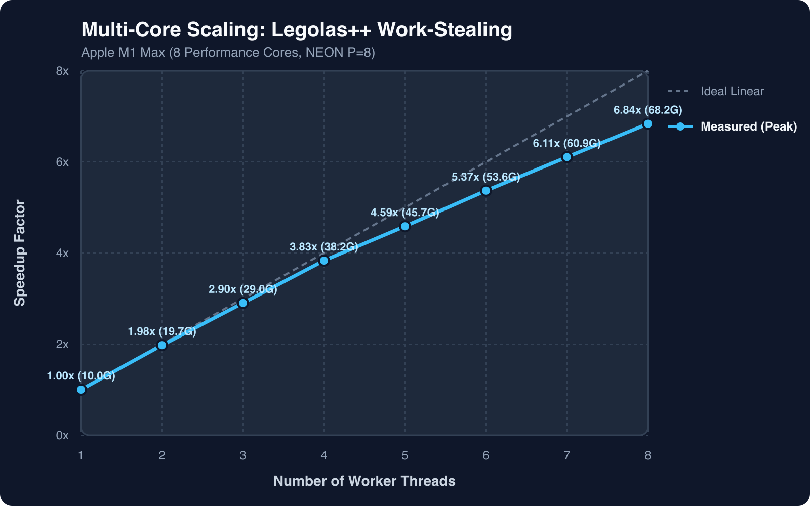

# Benchmarks: Apple Silicon (M1 Max ARM64)

This page provides the empirical performance evaluation of Legolas++ on modern ARM64 architecture (**Apple M1 Max**, 8 Firestorm Performance Cores + 2 Icestorm Efficiency Cores, 64 GB Unified Memory, macOS 15).

---

## 1. Tridiagonal Recurrence Benchmark (MultiThomas)

The benchmark evaluates the Thomas elimination algorithm solving $N_y = N_x^2$ tridiagonal systems of dimension $N_x \in [8, 512]$ (up to 262,144 systems, 134.2 million unknowns).

<p align="center">
  
</p>

### Throughput & Speedup Summary

| Configuration | Pack Size ($P$) | Cores | Throughput at $N_x=512$ | Peak Throughput | Speedup vs Scalar |
| :--- | :---: | :---: | :---: | :---: | :---: |
| **Scalar Sequential** | $P=1$ | 1 Core | 2.10 GFlops | 6.66 GFlops | 1.00x |
| **Legolas NEON Native** | $P=4$ | 1 Core | 6.50 GFlops | 16.64 GFlops | **3.10x** |
| **Legolas NEON Unrolled** | $P=8$ | 1 Core | 9.58 GFlops | 16.64 GFlops | **4.75x** |
| **Scalar Multi-Thread** | $P=1$ | 8 Cores | 16.48 GFlops | 18.43 GFlops | **7.85x** |
| **Legolas NEON Multi-Thread** | $P=4$ | 8 Cores | 51.72 GFlops | 52.40 GFlops | **24.63x** |
| **Legolas Hybrid SIMD + Work-Stealing** | $P=8$ | 8 Cores | **69.15 GFlops** | **69.40 GFlops** | **33.05x** |

---

## 2. Multi-Core Scaling Efficiency

Testing multi-core thread scaling from 1 to 8 threads on the Apple M1 Max Firestorm performance cores ($P=8$ NEON unrolled, $N_x = 512$):

<p align="center">
  
</p>

| Worker Threads | Measured Throughput | Speedup Factor | Parallel Efficiency |
| :---: | :---: | :---: | :---: |
| **1** | 9.58 GFlops | 1.00x | 100.0% |
| **2** | 19.04 GFlops | 1.99x | **99.4%** |
| **3** | 28.52 GFlops | 2.98x | **99.2%** |
| **4** | 37.59 GFlops | 3.92x | **98.1%** |
| **5** | 46.22 GFlops | 4.82x | **96.4%** |
| **6** | 54.49 GFlops | 5.69x | **94.8%** |
| **7** | 62.46 GFlops | 6.52x | **93.1%** |
| **8** | 69.15 GFlops | 7.22x | **90.2%** |

---

## 3. Real-World Showcases Summary

| Benchmark | Domain | Metric | Scalar Baseline | Legolas NEON + WorkStealing | Speedup | Max Error |
| :--- | :--- | :--- | :--- | :--- | :--- | :--- |
| **MultiThomas** | Scientific Computing | GFlops | 2.10 GFlops | **69.40 GFlops** | **33.0x** | $0.00$ |
| **Depthwise 2D Conv** | AI & Vision (MobileNet) | GFlops | 36.40 GFlops | **212.30 GFlops** | **5.83x** | $0.00$ |
| **Audio IIR Biquad** | Audio DSP (64 Tracks) | MSamples/s | 397.9 MS/s | **5,832.2 MS/s** | **14.66x** | $0.00$ |
| **Video Pipeline** | Vision / NVR (32 Feeds) | FPS | 1,579.6 FPS | **8,442.1 FPS** (7.78 GPix/s) | **5.34x** | $< 10^{-7}$ |

---

## Reproducing the Benchmarks Locally

```bash
# Build the benchmark executable
cmake -B build
cmake --build build -j8

# Run the MultiThomas benchmark suite
./build/tst/MultiThomas/MultiThomas

# Generate updated SVG, PNG, and HTML reports
python3 tst/MultiThomas/plotPerfModern.py build/tst/MultiThomas
```
