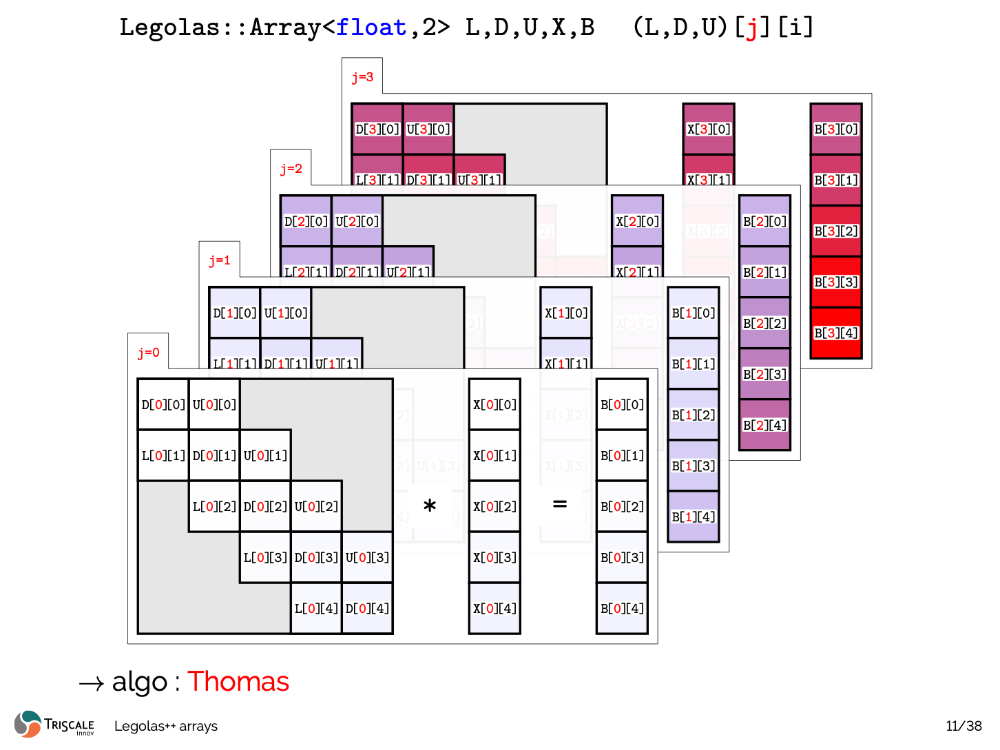
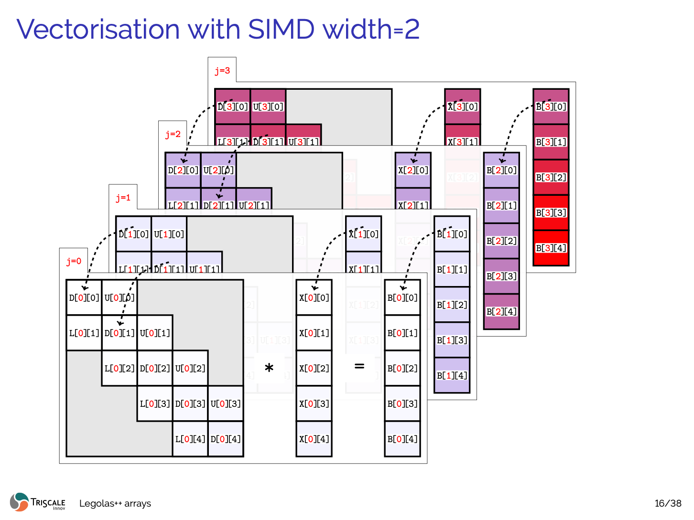
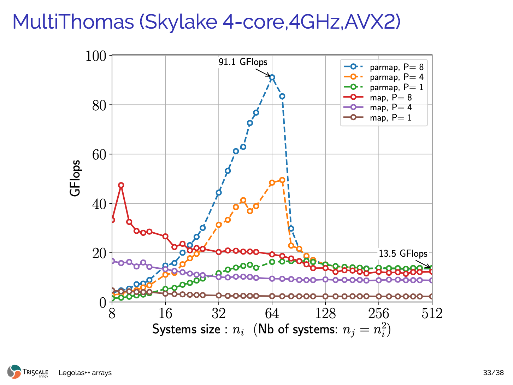

# Data Layout Interleaving (DLI)

The central innovation of Legolas++ is **Data Layout Interleaving (DLI)**.

Rather than attempting to parallelize along the sequential recurrence dimension $i$, Legolas++ packs corresponding elements from $P$ independent problem instances directly into contiguous physical memory.

---

## Memory Layout Comparison

## The Fundamental Motivation: Independent Ensembles

In high-performance numerical computing, we rarely solve a single isolated recurrence in isolation. Instead, we typically solve an **ensemble of $M$ independent problem instances** of size $N$:


*Figure 1: Ensemble of $M$ independent linear systems $T_j X_j = B_j$ (each of size $N$) represented as 2D slices $j = 0, 1, 2, 3\dots$ with tridiagonal bands $(L, D, U)[j][i]$.*

---

## The Cross-System Vectorization Dilemma

Consider trying to vectorize across these independent systems using a SIMD vector width of $P = 2, 4,$ or $8$:


*Figure 2: Without interleaving, elements at identical step $i$ across systems (e.g. $D[0][0]$ and $D[1][0]$) reside on distinct memory slices separated by stride $N$. Loading them into a SIMD vector requires costly non-contiguous gather operations.*

In standard C++ (e.g. `std::vector<std::vector<float>>`, nested arrays, or standard row-major flat buffers `float[M][N]`):
- System $j=0$: `[ X[0][0], X[0][1], X[0][2], ... X[0][N-1] ]`
- System $j=1$: `[ X[1][0], X[1][1], X[1][2], ... X[1][N-1] ]`
- System $j=2$: `[ X[2][0], X[2][1], X[2][2], ... X[2][N-1] ]`
- System $j=3$: `[ X[3][0], X[3][1], X[3][2], ... X[3][N-1] ]`

To pack elements $X[0][i], X[1][i], X[2][i], X[3][i]$ into a 128-bit or 256-bit SIMD register, the CPU cannot issue a linear vector load. It must either perform scalar gathers or explicit register transposes, bottlenecking the memory subsystem and destroying throughput.

---

## The Legolas++ Solution: Data Layout Interleaving (DLI)

Legolas++ eliminates this overhead by **interleaving data across systems directly at allocation time**:

<p align="center">
  
</p>

*Figure 3: Animated DLI Mechanism. Elements at identical step $i$ across $P=4$ independent systems are interleaved contiguously in physical memory, allowing a single aligned 128-bit / 256-bit SIMD vector instruction (`ldr q` / `vmovaps`) to load all 4 elements in a single clock cycle.*

With a packing factor of $P = 4$ along dimension $D = 2$:

```
Physical Memory Stream:
Packet 0 (i = 0): [ X[0][0], X[1][0], X[2][0], X[3][0] ]  <-- 1 Single Aligned SIMD Load
Packet 1 (i = 1): [ X[0][1], X[1][1], X[2][1], X[3][1] ]  <-- 1 Single Aligned SIMD Load
Packet 2 (i = 2): [ X[0][2], X[1][2], X[2][2], X[3][2] ]  <-- 1 Single Aligned SIMD Load
...
Packet N-1 (i = N-1): [ X[0][N-1], X[1][N-1], X[2][N-1], X[3][N-1] ]
```

When stepping sequentially through $i = 0, 1, \dots, N-1$ along the recurrence:
- **100% Contiguous Linear Streaming**: Hardware L1/L2 prefetchers operate at peak theoretical bandwidth.
- **Zero Gather / Scatter**: Every vector load/store is a single unmasked 128-bit, 256-bit, or 512-bit instruction (`ldr q` on ARM NEON, `vmovaps` on x86 AVX2/AVX-512).
- **Zero Transpose Overhead**: No instructions are wasted on register shuffles or unpacking.

---

## Zero-Overhead Abstraction: `.getPackedView()`

How does Legolas++ present this interleaved layout to user code without making the algorithm messy?

When an array `Legolas::Array<float, 2, P, 2>` is passed to an algorithm via `Legolas::map` or `Legolas::parmap`:
1. Legolas++ calls `.getPackedView()` on the tensor.
2. The packed view has rank 2, but its effective outer dimension is $M / P$, and its element scalar type is reinterpreted directly as a SIMD vector pack `Legolas::NativeSimd<float, P>` (using GCC/Clang vector extensions `__attribute__((vector_size(P * sizeof(float))))` or MSVC emulation).
3. In user code, the exact same mathematical solver runs unchanged:
   ```cpp
   auto row = A[j];
   auto val = row[i]; // val is a SIMD vector pack of P floats!
   ```
4. All arithmetic operators (`+`, `-`, `*`, `/`, FMA) applied to `val` are emitted by the compiler directly as native hardware vector instructions (ARM NEON `fadd.4s`, `fmla.4s` or x86 AVX2 `vaddps`, `vfmadd213ps`).

---

## Historical Benchmark Validation: Skylake AVX2

The performance impact of this transformation was originally demonstrated on an Intel Core i7-6700K (Skylake 4.0 GHz, AVX2):


*Figure 4: Historical benchmark on Intel Skylake (4 cores, 4.0 GHz, AVX2). Transitioning from scalar ($P=1$) to AVX2 ($P=8$) combined with multi-core parallel mapping (`parmap`) elevates tridiagonal recurrence throughput from 2.4 GFlops to **91.1 GFlops**.*

---

## Why DLI is Superior to Transpose-on-the-Fly

Some libraries store arrays in standard layout and transpose blocks into registers using shuffle instructions before computing.

| Feature | Transpose-on-the-fly | Legolas++ DLI |
| :--- | :--- | :--- |
| **Allocation** | Standard row-major | Interleaved directly at creation |
| **Compute Overhead** | Instructions wasted on register shuffles / unpacks | **0 instructions wasted** |
| **Bandwidth** | Saturated by gather/scatter or extra transpose passes | **100% linear streaming** |
| **Memory Reuse** | Temporary registers consumed by transposes | Maximum register budget available for FMA accumulation |
