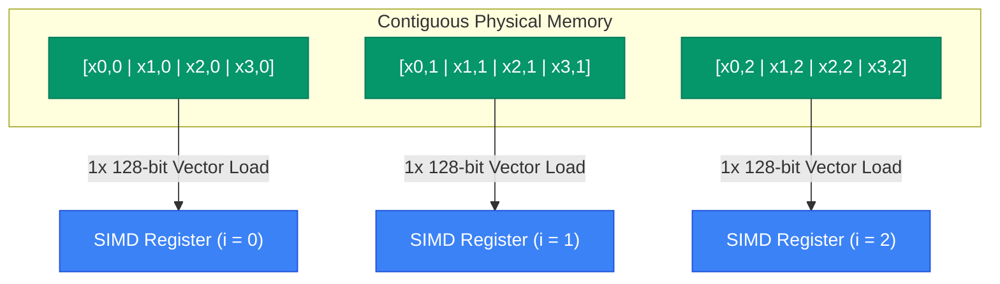

# Data Layout Interleaving (DLI)

The central innovation of Legolas++ is **Data Layout Interleaving (DLI)**.

Rather than attempting to parallelize along the sequential recurrence dimension $i$, Legolas++ packs corresponding elements from $P$ independent problem instances directly into contiguous physical memory.

---

## Memory Layout Comparison

Suppose we are solving $M$ independent instances of a recurrence problem of size $N$. Let $x_{j, i}$ denote element $i$ of problem instance $j$.

### 1. Standard Layout (AoS / SoA Row-Major)

In standard C++ (e.g. `std::vector<std::vector<float>>` or a flat buffer `float[M][N]`):

```
Instance 0: [ x0,0 , x0,1 , x0,2 , ... , x0,N-1 ]
Instance 1: [ x1,0 , x1,1 , x1,2 , ... , x1,N-1 ]
Instance 2: [ x2,0 , x2,1 , x2,2 , ... , x2,N-1 ]
Instance 3: [ x3,0 , x3,1 , x3,2 , ... , x3,N-1 ]
```

To load element $i=0$ across instances 0, 1, 2, 3 into a SIMD vector register, the CPU must issue 4 separate scalar loads with a stride of $N$ floats (or a hardware gather instruction). Strided loads and gathers are notoriously slow and waste cache bandwidth.

---

### 2. Legolas++ Interleaved Layout (DLI)

With Legolas++, data is allocated so that elements at position $i$ across $P$ consecutive problem instances are contiguous in memory:

```
Packet 0 (i=0): [ x0,0 , x1,0 , x2,0 , x3,0 ]  <-- 1 Single SIMD Vector Load!
Packet 1 (i=1): [ x0,1 , x1,1 , x2,1 , x3,1 ]  <-- 1 Single SIMD Vector Load!
Packet 2 (i=2): [ x0,2 , x1,2 , x2,2 , x3,2 ]  <-- 1 Single SIMD Vector Load!
...
Packet N-1:     [ x0,N-1 , x1,N-1 , x2,N-1 , x3,N-1 ]
```



When stepping sequentially through $i = 0, 1, \dots, N-1$, the CPU accesses memory in **linear streaming fashion**:
- Perfect L1/L2 prefetching.
- Zero cache line waste.
- Single-instruction aligned vector loads (`ldr q` on ARM NEON, `vmovaps` on AVX).

---

## Zero-Overhead Abstraction: `.getPackedView()`

How does Legolas++ present this interleaved layout to user code without making the algorithm messy?

When an array `Legolas::Array<float, 2, P, 2>` is passed to an algorithm via `Legolas::map` or `Legolas::parmap`:
1. Legolas++ calls `.getPackedView()` on the tensor.
2. The packed view has rank 2, but its effective outer dimension is $M / P$, and its element scalar type is reinterpreted as an **Eigen fixed-size vector**:
   ```cpp
   Eigen::Array<float, P, 1>
   ```
3. In user code:
   ```cpp
   auto row = A[j];
   auto val = row[i]; // val is an Eigen::Array<float, P, 1>!
   ```
4. All arithmetic operators (`+`, `-`, `*`, `/`) applied to `val` are mapped by Eigen directly into hardware vector instructions.

---

## Why DLI is Superior to Transpose-on-the-Fly

Some libraries store arrays in standard layout and transpose blocks into registers using shuffle instructions before computing.

| Feature | Transpose-on-the-fly | Legolas++ DLI |
| :--- | :--- | :--- |
| **Allocation** | Standard row-major | Interleaved directly at creation |
| **Compute Overhead** | Instructions wasted on register shuffles / unpacks | **0 instructions wasted** |
| **Bandwidth** | Saturated by gather/scatter or extra transpose passes | **100% linear streaming** |
| **Memory Reuse** | Temporary registers consumed by transposes | Maximum register budget available for FMA accumulation |
