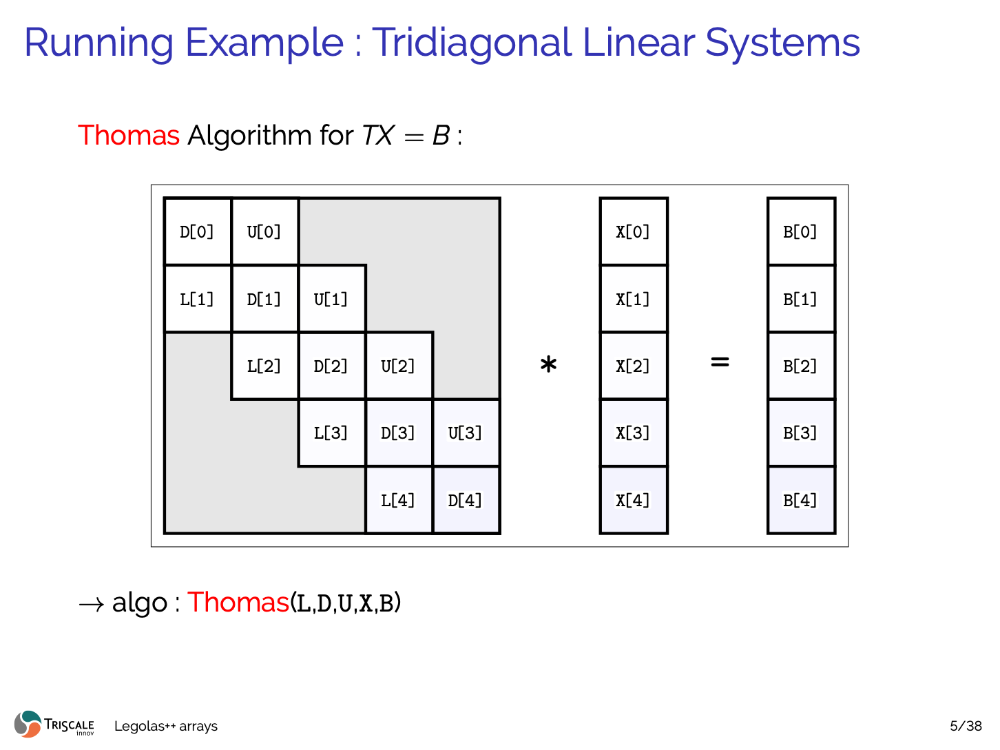
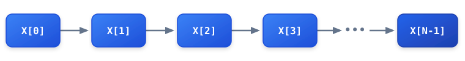

# The Recurrence Barrier

Modern CPU microarchitectures feature wide vector units:
- **ARM64 NEON**: 128-bit registers (4 single-precision floats or 2 double-precision floats).
- **x86 AVX2**: 256-bit registers (8 single-precision floats or 4 double-precision floats).
- **x86 AVX-512**: 512-bit registers (16 single-precision floats or 8 double-precision floats).

In theory, SIMD execution can deliver between $4\times$ and $16\times$ raw arithmetic throughput compared to scalar code.

In practice, however, many algorithms in engineering, finance, and AI fail to vectorize. The primary obstacle is the **loop-carried data dependency**.

---

## What is a Loop-Carried Dependency?


*Figure 1: Tridiagonal linear system $TX = B$ with matrix bands $(L, D, U)$, solution vector $X$, and right-hand side $B$.*

Consider the forward sweep of the classic **Thomas algorithm** for tridiagonal systems $T x = b$, or a 1st-order IIR filter:

```cpp
for (int i = 1; i < N; ++i) {
    X[i] = (B[i] - L[i] * X[i - 1]) * invD[i];
}
```

Notice that computing $X[i]$ requires the value $X[i-1]$ calculated in the immediately preceding iteration.


*Figure 2: Sequential recurrence chain — iteration $i$ is strictly dependent on the result of iteration $i-1$.*

Because iteration $i$ cannot start before iteration $i-1$ has finished, the instructions must execute sequentially. The CPU cannot pack multiple iterations of $i$ into a SIMD vector register.

---

## Why Auto-Vectorizers Give Up

When an optimizing compiler (Clang, GCC, MSVC, Intel oneAPI) inspects this loop:
1. It builds a data dependency graph.
2. It detects a true data dependency (Read-After-Write, RAW hazard) across loop iterations.
3. It emits a diagnostic report:
   ```text
   remark: loop not vectorized: cannot prove it is safe to reorder floating-point operations
   remark: loop not vectorized: value is used outside the loop / recurrence detected
   ```
4. It falls back to scalar execution.

Even aggressive compiler pragmas like `#pragma omp simd` or `#pragma GCC ivdep` cannot help: reordering the operations would alter the mathematical recurrence and produce invalid numerical results.

---

## Where Do Recurrences Occur?

| Domain | Algorithm | Recurrence Nature |
| :--- | :--- | :--- |
| **PDEs & Physics** | Alternating Direction Implicit (ADI), Crank-Nicolson | Tridiagonal / Pentadiagonal systems along mesh lines |
| **Digital Signal Processing** | IIR Biquad Equalizers, Crossovers, Audio FX | Temporal feedback $y[n] = f(y[n-1], y[n-2])$ |
| **Quantitative Finance** | Black-Scholes PDE, Dupire local volatility | Implicit time-stepping matrices |
| **Deep Learning** | Selective State Spaces (Mamba, S4, Linear RNNs) | Causal hidden state updates $h_t = A h_{t-1} + B x_t$ |
| **Computer Vision** | Depthwise Separable Convolutions | Channel-independent spatial filtering with short loops |

---

## The Way Forward

To vectorize these algorithms, we must look beyond a single problem instance. In real applications, we almost never solve a single recurrence in isolation—we solve hundreds or thousands of them.

Legolas++ exploits this higher-level parallelism by **interleaving data across problem instances** at the memory layout level.
