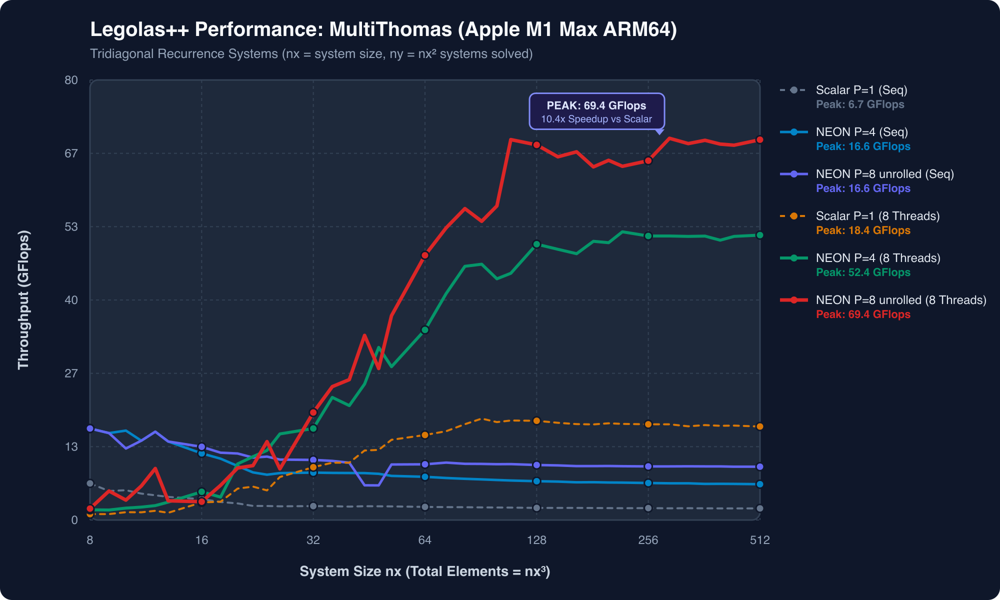

# Legolas++

<p align="center">
  <em>High-Performance Modern C++ Tensor Engine for Automatic SIMD Vectorization & Multi-Core Work-Stealing via Data Layout Interleaving (DLI).</em>
</p>

---

## What is Legolas++?

**Legolas++** solves one of the most stubborn performance bottlenecks in scientific and numeric computing: **loop-carried recurrences** ($X_i = f(X_{i-1})$).

Compilers cannot auto-vectorize sequential recurrences because each step strictly requires the output of the preceding step.

Instead of fighting the compiler or rewriting complex assembly, Legolas++ introduces **Data Layout Interleaving (DLI)**:
When computing ensembles of independent problem instances (audio tracks, ADI mesh lines, image channels, option pricing grids), Legolas++ packs elements across instances contiguously into memory. 

The exact same generic algorithm code written using natural scalar math executes on SIMD registers (**ARM NEON**, **x86 AVX2 / AVX-512**) with **zero code modifications** and **zero overhead**.

---

## Key Highlights

- :rocket: **Break the Recurrence Barrier**: Vectorize tridiagonal solvers (Thomas algorithm), IIR digital filters, and depthwise convolutions with 100% hardware SIMD register utilization.
- :zap: **Write Once, Vectorize Everywhere**: A single template implementation works for both scalar types and hardware SIMD vectors (`Eigen::Array<T, P, 1>`).
- :twisted_right_wards_arrows: **Two-Level Hybrid Parallelism**: 
    1. **Data-Level (SIMD)**: Automatic via Data Layout Interleaving.
    2. **Thread-Level (Multi-Core)**: Built-in, header-only lock-minimized **Work-Stealing** loop scheduler (or optional Intel oneTBB).
- :apple: **First-Class Apple Silicon & x86 Support**: Tuned for ARM64 NEON (Apple M1/M2/M3/M4) and x86 AVX2 / AVX-512.
- :package: **Zero External Dependencies**: Operates header-only with Eigen and the native work-stealing engine without requiring external shared libraries.

---

## Apple Silicon (M1 Max) Benchmark Summary

On tridiagonal recurrence systems ($N_x \in [8, 512]$, up to 262,144 systems, 134 million unknowns):

| Mode | Pack Size ($P$) | Execution | Large Size Throughput ($N_x=512$) | Peak Throughput | Speedup vs Scalar |
| :--- | :---: | :---: | :---: | :---: | :---: |
| **Scalar Baseline** | $P=1$ | Sequential (1 Core) | 2.10 GFlops | 6.66 GFlops | 1.00x |
| **Legolas NEON SIMD** | $P=4$ | Sequential (1 Core) | 6.50 GFlops | 16.64 GFlops | **3.10x** |
| **Legolas NEON Unrolled** | $P=8$ | Sequential (1 Core) | 9.58 GFlops | 16.64 GFlops | **4.75x** |
| **Scalar Multi-Thread** | $P=1$ | Parallel (8 Cores) | 16.48 GFlops | 18.43 GFlops | **7.85x** |
| **Legolas NEON Multi-Thread** | $P=4$ | Parallel (8 Cores) | 51.72 GFlops | 52.40 GFlops | **24.63x** |
| **Legolas Hybrid SIMD + Work-Stealing** | $P=8$ | Parallel (8 Cores) | **69.15 GFlops** | **69.40 GFlops** | **33.05x** |

<p align="center">
  
</p>

---

## Quick Example in 15 Seconds

```cpp
#include <iostream>
#include "Legolas/Array/Array.hxx"
#include "Legolas/Array/Map.hxx"

// 1. Define an algorithm once using natural scalar math:
struct Scaler {
    template <class A2D>
    void operator()(int begin, int end, A2D X, A2D Y) const {
        using Scalar = typename A2D::RealType;
        Scalar factor(2.5f);
        for (int j = begin; j < end; ++j) {
            for (int i = 0; i < X[j].size(); ++i) {
                Y[j][i] = factor * X[j][i]; // Compiles to NEON/AVX FMA automatically!
            }
        }
    }
};

int main() {
    // 2. Declare 2D array packed across Y with P=4 (4 elements contiguous in memory):
    using Array2D = Legolas::Array<float, 2, 4, 2>; // 1024 systems of size 256
    Array2D X(1024, 256), Y(1024, 256);
    X.fill(1.0f);

    // 3. Parallelize across cores and vectorize in SIMD simultaneously:
    Legolas::parmap(Scaler(), X, Y);

    std::cout << "Done with zero overhead!" << std::endl;
    return 0;
}
```

---

## Citation & Origins

Legolas++ is based on the research presented at **ACM SIGPLAN ARRAY 2017**:

> **Portable vectorization and parallelization of C++ multi-dimensional array computations**  
> Laurent Plagne & Kaveh Bojnourdi  
> *Proceedings of the 4th ACM SIGPLAN International Workshop on Libraries, Languages, and Compilers for Array Programming (ARRAY 2017)*, Pages 47–54.  
> DOI: [10.1145/3091966.3091973](https://doi.org/10.1145/3091966.3091973)
