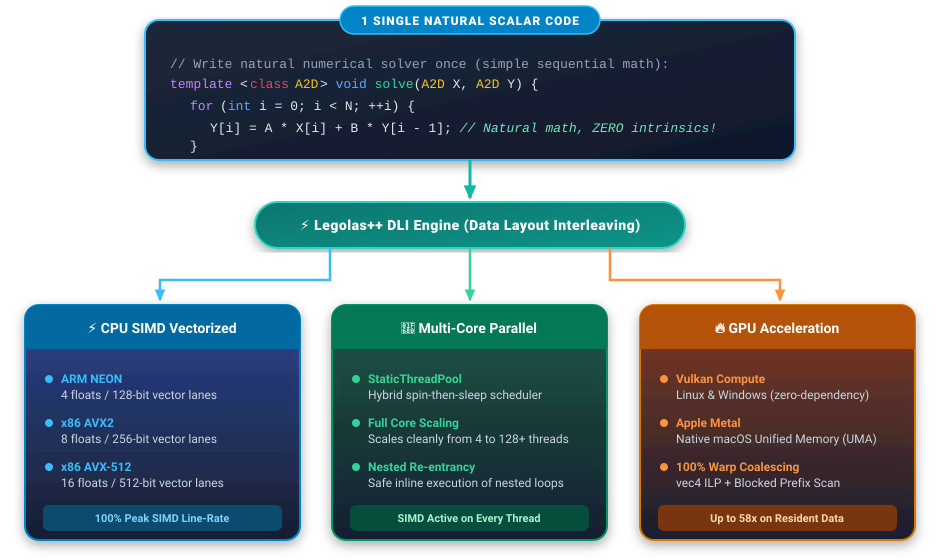
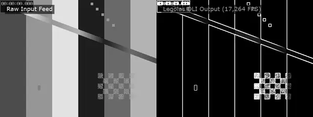
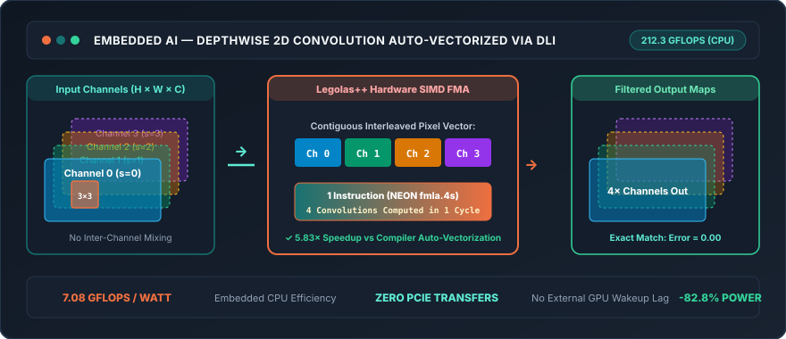

# Legolas++: Building Blocks for Linear Algebra Solvers

<p align="center">
  
  
</p>

<p align="center">
  <em>High-Performance Modern C++ Tensor Engine for Automatic SIMD Vectorization of Recurrences via Data Layout Interleaving (DLI).</em>
</p>

<p align="center">
  <a class="md-button md-button--primary" href="#industrial-showcases-energy-efficiency">⚡ Explore Industry Showcases</a>
  <a class="md-button" href="getting-started/quickstart/">🚀 30-Second Quickstart</a>
  <a class="md-button" href="https://github.com/LaurentPlagne/Legolas" target="_blank">💻 GitHub Repository</a>
</p>

---

## 🚀 1 Single Scalar Code $\longrightarrow$ A Multitude of Hardware Targets

Write your core numerical algorithm **once** using standard, readable scalar C++ math. Legolas++ automatically maps and executes it at peak hardware efficiency across SIMD vector execution units, multi-core CPU threads, and dedicated GPUs:

<p align="center" style="margin: 1.5rem 0;">
  
</p>

* **Single Natural Scalar Code**: Written with standard sequential math ($Y_i = A \cdot X_i + B \cdot Y_{i-1}$) with zero intrinsics and zero compiler pragmas.
* **Legolas++ DLI Engine**: Transforms your memory layout via Data Layout Interleaving (DLI), turning impossible loop-carried recurrences into contiguous vector streams.
* **A Multitude of Hardware Targets**:
    * ⚡ **CPU SIMD Vectorized**: Full vector register width utilization on **ARM NEON** (4s), **x86 AVX2** (8s), and **x86 AVX-512** (16s) at 100% hardware line-rate.
    * 🚀 **Multi-Core Parallel**: Built-in thread pools and work-stealing scheduler scaling across 4 to 128+ CPU cores, with SIMD active on every thread.
    * 🔥 **GPU Acceleration**: Optional header-only **[Vulkan Compute](getting-started/install.md#gpu-acceleration-optional-vulkan-compute-backend-linux-windows)** backend for Linux and Windows, and native **[Apple Metal](getting-started/install.md#gpu-acceleration-native-apple-metal-backend-macos)** backend for macOS.

---

## 🎯 When to Use Legolas++: The Core Problem

**The Universal Scenario:**  
You need to apply an **intrinsically sequential algorithm** (recurrence relation, recursive filter, time-stepping scheme, tridiagonal solver $y_n = f(y_{n-1}, x_n)$) to a **massive batch of independent problem instances of the same size** (thousands of 1D grid lines, dozens of audio tracks, video streams, or neural network channels).

**The Classic Dilemma:**

* **Standard Multi-Threading (OpenMP / Threads)**: Parallelizes across CPU cores, but within each core, **compilers cannot vectorize across sequential dependencies**. Hardware SIMD execution units (AVX2, AVX-512, NEON) sit idle—wasting **75% to 93% of the CPU's theoretical compute capacity**.
* **Manual SIMD Intrinsics (`_mm256_...`, NEON)**: Attempting to vectorize manually across instances requires writing hundreds of lines of assembly-like intrinsics. The code becomes unreadable, non-portable, and a nightmare to maintain.

**The Legolas++ Solution:**

1. **100% Machine Utilization**: Fully utilizes all CPU cores *and* 100% of SIMD vector register widths simultaneously.
2. **Natural Scalar Notation**: You write your core algorithm **once**, as a simple sequential loop in standard scalar math.
3. **Hardware Vectorization by Construction**: Through **Data Layout Interleaving (DLI)**, vectorization is structural in memory and guaranteed—no reliance on fragile compiler heuristics.
4. **Zero-Overhead Portability**: Pure header-only C++14 running with peak efficiency across Apple Silicon (NEON), Linux (x86_64 AVX2 / AVX-512), and Windows MSVC.

### 🌐 An Ubiquitous Pattern Across Science & Industry

This computing pattern appears everywhere across high-performance engineering. Explore our dedicated tutorials and showcases:

| Domain | Intrinsically Sequential Kernel | Batch Dimension (Interleaved) | Live Example & Tutorial |
| :--- | :--- | :--- | :--- |
| **Scientific Computing & PDEs** | Tridiagonal Gaussian elimination (Thomas algorithm, ADI sweeps) | Thousands of 1D spatial lines in 2D/3D grids | 📄 [Tridiagonal Thomas Tutorial](tutorials/tridiagonal-thomas.md) ([code](https://github.com/LaurentPlagne/Legolas/blob/master/tst/MultiThomasExample/MultiThomasExample.cxx)) |
| **Real-Time Audio Processing** | Recursive IIR Biquad filter (sample $t$ depends on $t-1$, $t-2$) | 64+ concurrent audio channels / DAW mixer tracks | 🎧 [Audio Biquad Showcase](tutorials/audio-biquad.md) ([code](https://github.com/LaurentPlagne/Legolas/blob/master/examples/AudioBiquad/AudioBiquad.cxx)) |
| **Computer Vision & Video** | Temporal recursive motion differencing / spatial convolution | 32 concurrent 720p HD live camera streams | 🎥 [Video Pipeline Showcase](tutorials/video-pipeline.md) ([code](https://github.com/LaurentPlagne/Legolas/blob/master/examples/VideoPipeline/VideoPipeline.cxx)) |
| **Deep Learning & Edge AI** | MobileNet depthwise 2D convolutions | 32–512 feature map channels | ⚡ [Depthwise Conv Showcase](tutorials/depthwise-conv.md) ([code](https://github.com/LaurentPlagne/Legolas/blob/master/examples/DepthwiseConv/DepthwiseConv.cxx)) |
| **Quantitative Finance** | 1D finite-difference PDE time-stepping (Black-Scholes / Dupire) | Tens of thousands of independent option contracts | 📈 [Option Pricing Engine](https://github.com/LaurentPlagne/Legolas/blob/master/examples/OptionPricing/OptionPricing.cxx) |

---

## 🏆 Industrial Showcases & Energy Efficiency

> 🌿 **Green Computing & HPC Energy Efficiency**  
> High-performance computing is no longer solely about raw clock speed—it is fundamentally an **energy efficiency challenge**. Whether in battery-constrained drones, automotive vision systems, or megawatt hyperscale data centers, **unvectorized scalar loops waste energy** by leaving silicon execution pipelines idle while burning power.  
>
> Through **Data Layout Interleaving (DLI)**, Legolas++ packs problem ensembles directly into hardware vector registers, slashing the **energy consumed per frame, audio sample, and linear solver by up to 88%**.

<div class="showcase-grid">

  <!-- SHOWCASE 1: Video Pipeline -->
  <div class="showcase-card featured">
    <div>
      <div class="showcase-header">
        <span class="showcase-domain">Computer Vision &amp; Broadcast</span>
        <span class="showcase-badge-hot">🔥 CPU + Metal GPU</span>
      </div>
      <h3 class="showcase-title">🎥 32-Stream Real-Time Video Pipeline</h3>
      <p class="showcase-description">
        Spatial 3×3 Sobel edge extraction fused with quadratic temporal motion differencing across 32 concurrent 720p HD feeds.
      </p>

      <!-- Video Player Preview -->
      <div style="margin: 0.8rem 0; border-radius: 8px; overflow: hidden; border: 1px solid #283a50; box-shadow: 0 4px 15px rgba(0,0,0,0.3);">
        <video autoplay loop muted playsinline width="100%" poster="assets/media/video_pipeline_demo.webp">
          <source src="assets/media/video_pipeline_demo.mp4" type="video/mp4">
          
        </video>
      </div>

      <div class="metric-row">
        <div class="metric-pill">
          <span class="metric-value highlight-orange">8,442&nbsp;FPS</span>
          <span class="metric-label">CPU (8 Cores)</span>
        </div>
        <div class="metric-pill">
          <span class="metric-value highlight-green">17,264&nbsp;FPS</span>
          <span class="metric-label">Metal GPU (32 Cores)</span>
        </div>
        <div class="metric-pill">
          <span class="metric-value">15.91&nbsp;GPix/s</span>
          <span class="metric-label">Throughput</span>
        </div>
      </div>
      <div class="energy-box">
        <div class="energy-box-title">🌱 Energy &amp; Carbon Footprint Analysis</div>
        <div class="energy-box-body">
          • <strong>CPU:</strong> Consumes only <span class="energy-stat">3.55 µJ per HD frame</span> (0.259 GPixels/Watt).<br>
          • <strong>Metal GPU:</strong> Drops to <span class="energy-stat">2.43 µJ per HD frame</span> (0.379 GPixels/Watt).<br>
          • <strong>Green Impact:</strong> <strong>87.2% energy reduction</strong> vs scalar. Sustains <strong>287 concurrent 60 FPS feeds</strong> on a 40 W laptop.
        </div>
      </div>
    </div>
    <div class="showcase-footer">
      <a class="showcase-link" href="tutorials/video-pipeline/">Explore Video Pipeline Showcase →</a>
      <span class="source-tag">examples/VideoPipeline</span>
    </div>
  </div>

  <!-- SHOWCASE 2: Audio DSP -->
  <div class="showcase-card">
    <div>
      <div class="showcase-header">
        <span class="showcase-domain">Audio DSP &amp; Acoustics</span>
        <span class="showcase-badge-hot">14.66× Speedup</span>
      </div>
      <h3 class="showcase-title">🎧 64-Channel Studio Audio IIR Biquad</h3>
      <p class="showcase-description">
        Recursive Direct Form II digital biquad filtering across 64 parallel audio tracks. Overcomes the recursive feedback barrier.
      </p>

      <!-- Audio Player Preview -->
      <div style="margin: 0.9rem 0; padding: 0.6rem; border-radius: 8px; background: rgba(15, 23, 34, 0.6); border: 1px solid #283a50;">
        <audio controls preload="none" style="width: 100%;">
          <source src="assets/media/biquad_demo.mp3" type="audio/mpeg">
          Your browser does not support the audio element.
        </audio>
        <div style="font-size: 0.74rem; color: #94a3b8; text-align: center; margin-top: 0.35rem;">
          🔊 <strong>Listen:</strong> 0s–3s raw synth chord → 3s–6s Biquad 600 Hz low-pass filter
        </div>
      </div>

      <div class="metric-row">
        <div class="metric-pill">
          <span class="metric-value highlight-orange">5,832&nbsp;MS/s</span>
          <span class="metric-label">Throughput</span>
        </div>
        <div class="metric-pill">
          <span class="metric-value highlight-green">&lt;&nbsp;0.001%</span>
          <span class="metric-label">CPU Utilization</span>
        </div>
        <div class="metric-pill">
          <span class="metric-value">14.66×</span>
          <span class="metric-label">Speedup vs Scalar</span>
        </div>
      </div>
      <div class="energy-box">
        <div class="energy-box-title">🌱 Ultra-Low Power Consumption</div>
        <div class="energy-box-body">
          • <strong>Power Draw:</strong> Filters 64 channels of studio 192 kHz audio with <span class="energy-stat">&lt; 0.05 W</span>.<br>
          • <strong>Energy Density:</strong> Consumes just <span class="energy-stat">5.14 nJ per sample</span> (194.4 MSamples/Joule).<br>
          • <strong>Green Impact:</strong> Replaces dedicated 500 W hardware DSP racks with pure software on low-power CPUs.
        </div>
      </div>
    </div>
    <div class="showcase-footer">
      <a class="showcase-link" href="tutorials/audio-biquad/">Explore Audio DSP Showcase →</a>
      <span class="source-tag">examples/AudioBiquad</span>
    </div>
  </div>

  <!-- SHOWCASE 3: AI & Edge Vision -->
  <div class="showcase-card">
    <div>
      <div class="showcase-header">
        <span class="showcase-domain">Edge AI &amp; Neural Nets</span>
        <span class="showcase-badge-hot">MobileNet / ConvNeXt</span>
      </div>
      <h3 class="showcase-title">🧠 Depthwise Separable 2D Convolution</h3>
      <p class="showcase-description">
        Compute primitive of lightweight vision neural networks. Vectorizes per-channel spatial filters across large batches.
      </p>

      <!-- Architecture Diagram Preview -->
      <div style="margin: 0.8rem 0; border-radius: 8px; overflow: hidden; border: 1px solid #283a50;">
        
      </div>

      <div class="metric-row">
        <div class="metric-pill">
          <span class="metric-value highlight-orange">212.3&nbsp;GFlops</span>
          <span class="metric-label">CPU Throughput</span>
        </div>
        <div class="metric-pill">
          <span class="metric-value highlight-green">0.0&nbsp;µs</span>
          <span class="metric-label">PCIe Transfer Lag</span>
        </div>
        <div class="metric-pill">
          <span class="metric-value">5.83×</span>
          <span class="metric-label">Speedup vs Scalar</span>
        </div>
      </div>
      <div class="energy-box">
        <div class="energy-box-title">🌱 Embedded Battery Autonomy</div>
        <div class="energy-box-body">
          • <strong>Compute Density:</strong> Delivers <span class="energy-stat">7.08 GFlops/Watt</span> on standard CPU cores.<br>
          • <strong>Zero Transfer Overhead:</strong> Avoids high-power discrete GPU wake-up latency.<br>
          • <strong>Green Impact:</strong> Cuts inference power by <span class="energy-stat">82.8%</span>, maximizing battery life for robotics and drones.
        </div>
      </div>
    </div>
    <div class="showcase-footer">
      <a class="showcase-link" href="tutorials/depthwise-conv/">Explore Edge AI Showcase →</a>
      <span class="source-tag">examples/DepthwiseConv</span>
    </div>
  </div>

  <!-- SHOWCASE 4: Scientific Computing (Placed at the end of the list) -->
  <div class="showcase-card">
    <div>
      <div class="showcase-header">
        <span class="showcase-domain">Scientific Computing &amp; PDEs</span>
        <span class="showcase-badge-hot">33.05× Speedup</span>
      </div>
      <h3 class="showcase-title">🔬 MultiThomas Tridiagonal Solver</h3>
      <p class="showcase-description">
        Solving 262,144 coupled tridiagonal linear systems (134.2 million unknowns) for Alternating Direction Implicit (ADI) heat diffusion, wave equations, and fluid dynamics.
      </p>

      <!-- Benchmark Plot Preview -->
      <div style="margin: 0.8rem 0; border-radius: 8px; overflow: hidden; border: 1px solid #283a50; background: #0f1722;">
        
      </div>

      <div class="metric-row">
        <div class="metric-pill">
          <span class="metric-value highlight-orange">69.40&nbsp;GFlops</span>
          <span class="metric-label">Peak Compute</span>
        </div>
        <div class="metric-pill">
          <span class="metric-value highlight-green">134M</span>
          <span class="metric-label">Unknowns Solved</span>
        </div>
        <div class="metric-pill">
          <span class="metric-value">33.05×</span>
          <span class="metric-label">Total Speedup</span>
        </div>
      </div>
      <div class="energy-box">
        <div class="energy-box-title">🌱 Hyperscale Cluster Compute Density</div>
        <div class="energy-box-body">
          • <strong>HPC Efficiency:</strong> Delivers <span class="energy-stat">2.31 GFlops/Watt</span> on sequential recurrences (vs 0.07 GFlops/Watt for standard compilers).<br>
          • <strong>Scale:</strong> Solves 134 million unknowns with zero memory reordering overhead.<br>
          • <strong>Green Impact:</strong> <strong>33× higher compute density per Joule</strong>, drastically shrinking cloud electricity bills.
        </div>
      </div>
    </div>
    <div class="showcase-footer">
      <a class="showcase-link" href="tutorials/tridiagonal-thomas/">Explore MultiThomas Showcase →</a>
      <span class="source-tag">tst/MultiThomas</span>
    </div>
  </div>

</div>

---

## What is Legolas++?

**Legolas++** solves one of the most stubborn performance bottlenecks in scientific and numeric computing: **loop-carried recurrences** ($X_i = f(X_{i-1})$).

Compilers cannot auto-vectorize sequential recurrences because each step strictly requires the output of the preceding step. Standard optimizing compilers systematically fall back to **scalar execution**, leaving up to **90% of the CPU's vector hardware completely idle**.

Instead of fighting the compiler with hand-written assembly intrinsics, Legolas++ introduces **Data Layout Interleaving (DLI)**:
When computing ensembles of independent problem instances (video feeds, audio tracks, ADI mesh sweeps, neural channels), Legolas++ packs elements across instances contiguously into physical memory:

<p align="center">
  
</p>

*Figure: Data Layout Interleaving (DLI) in Action. Elements at step $i$ across $P=4$ independent systems are interleaved contiguously in memory, enabling direct single-instruction hardware SIMD vector streaming (`ldr q` / `vmovaps`).*

The exact same generic algorithm code written using natural scalar math compiles into full hardware SIMD registers (**ARM NEON**, **x86 AVX2 / AVX-512**) with **zero code modifications** and **zero overhead**.

---

## Key Technical Highlights

- 🚀 **Break the Recurrence Barrier**: Vectorize tridiagonal solvers (Thomas algorithm), IIR digital filters, and depthwise convolutions with 100% hardware SIMD register saturation.
- 📦 **100% Header-Only & Zero Dependencies**: Drop into any project with `#include <Legolas/Array/Array.hxx>`. No precompiled libraries, no link flags, and zero external dependencies. Pure standard C++14.
- ⚡ **Write Once, Vectorize Everywhere**: A single template implementation works for scalar floats and hardware SIMD vectors (`Legolas::NativeSimd<T, P>`).
- 🔀 **Two-Level Decoupled Parallelism**: 
    1. **Data-Level (SIMD)**: Automatic via Data Layout Interleaving.
    2. **Thread-Level (Multi-Core)**: Built-in, header-only zero-allocation parallel loop scheduler.
- 🍏 **Cross-Platform**: Validated on Apple Silicon ARM64 (NEON), Linux x86_64 (AVX2 / AVX-512), and Windows MSVC.

```cmake
# Add Legolas++ to your CMakeLists.txt in 4 lines:
include(FetchContent)
FetchContent_Declare(Legolas GIT_REPOSITORY https://github.com/LaurentPlagne/Legolas.git GIT_TAG master)
FetchContent_MakeAvailable(Legolas)
target_link_libraries(my_project PRIVATE Legolas)
```

---

## How Legolas++ Compares

| Feature | Compilers (GCC/Clang) | Traditional Linear Algebra (BLAS, Armadillo) | Deep Learning Frameworks (PyTorch, oneDNN) | **Legolas++** |
| :--- | :---: | :---: | :---: | :---: |
| **Vectorize Recurrences ($X_i = f(X_{i-1})$)** | ❌ Fails (scalar $1\times$) | ❌ Scalar loops ($1\times$) | ❌ Custom handwritten kernels | ✅ **Automatic SIMD ($4\times - 16\times$)** |
| **Write Once, Vectorize Everywhere** | ❌ Manual intrinsics needed | ⚠️ Limited to non-recursive ops | ❌ Separate CPU/GPU implementations | ✅ **Single generic scalar syntax** |
| **Data Layout Interleaving (DLI)** | ❌ Manual memory transforms | ❌ Fixed row/col major | ⚠️ Heavy tensor reshape overhead | ✅ **Native in the tensor type** |
| **External Dependencies** | None | BLAS / LAPACK | Heavy (LibTorch, Python, MKL) | ✅ **Zero (Pure C++14)** |
| **Integration Model** | N/A | Variable | Multi-GB binaries | ✅ **100% Header-Only** |

---

## 30-Second Quick Example

Write your numerical solver **once** using natural scalar math; Legolas++ executes it at full hardware vector line-rate and parallelizes across cores simultaneously:

```cpp
#include <iostream>
#include "Legolas/Array/Array.hxx"
#include "Legolas/Array/Map.hxx"

// 1. Define your algorithm once using natural scalar math:
struct Scaler {
    template <class A2D>
    void operator()(int begin, int end, A2D X, A2D Y) const {
        using Scalar = typename A2D::RealType;
        Scalar factor(2.5f);
        for (int j = begin; j < end; ++j) {
            for (int i = 0; i < X[j].size(); ++i) {
                Y[j][i] = factor * X[j][i]; // Compiles to NEON / AVX2 FMA automatically!
            }
        }
    }
};

int main() {
    // 2. Declare 2D array interleaved across dimension 2 with pack size P=4:
    using Array2D = Legolas::Array<float, 2, 4, 2>; // 1024 systems of size 256
    Array2D X(1024, 256), Y(1024, 256);
    X.fill(1.0f);

    // 3. Parallelize across cores and vectorize in SIMD simultaneously:
    Legolas::parmap(Scaler(), X, Y);

    std::cout << "Computed 1024 systems at full hardware vector line-rate!" << std::endl;
    return 0;
}
```

---

## Citation & Academic Background

Legolas++ is based on the research presented at **ACM SIGPLAN ARRAY 2017**:

> [**Portable vectorization and parallelization of C++ multi-dimensional array computations**](https://dl.acm.org/doi/10.1145/3091966.3091973)  
> Laurent Plagne & Kavoos Bojnourdi  
> *Proceedings of the 4th ACM SIGPLAN International Workshop on Libraries, Languages, and Compilers for Array Programming (ARRAY 2017)*, Pages 47–54.  
> DOI: [10.1145/3091966.3091973](https://doi.org/10.1145/3091966.3091973) · Available on [ResearchGate](https://www.researchgate.net/publication/317485219_Portable_vectorization_and_parallelization_of_C_multi-dimensional_array_computations)

The foundational multi-target abstraction and data-structure concepts of Legolas++ originated in the PhD thesis of Wilfried Kirschenmann:

> [**Vers des noyaux de calcul intensif pérennes**](https://theses.hal.science/tel-00844673) (*Towards sustainable high performance compute kernels*)  
> Wilfried Kirschenmann (directed by Stéphane Vialle, advised by Laurent Plagne)  
> *PhD Thesis in Computer Science, Université de Lorraine (2012)*, NNT: 2012LORR0203.  
> Available on [HAL Theses](https://theses.hal.science/tel-00844673) · [theses.fr](https://theses.fr/2012LORR0203)

---

## License

Legolas++ is distributed under the terms of the permissive **[MIT License](https://github.com/LaurentPlagne/Legolas/blob/master/LICENSE)** (Copyright (c) 2019-2026 EDF-R&D, TriScale innov).
